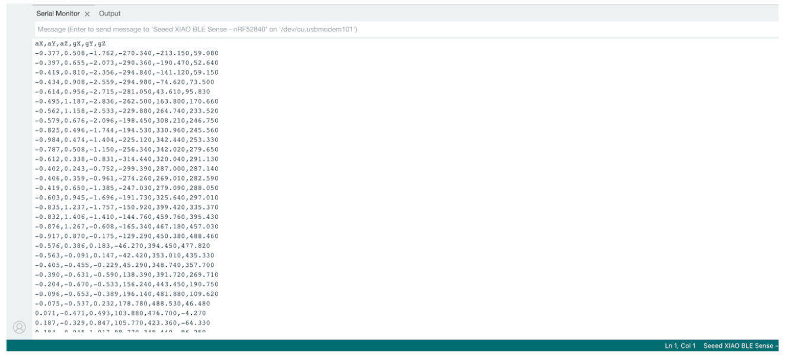
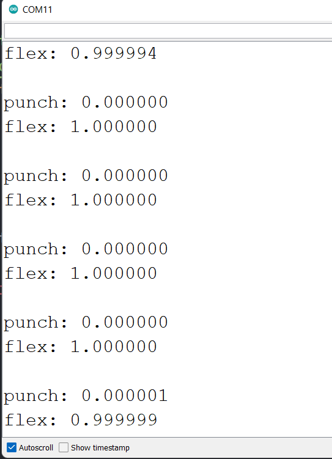

# CAIxIEEE-TinyML-Workshop
All the relevant links and such

# Software setup (Arduino)

- Step 1. Download and Install the latest version of Arduino IDE according to your operating system

  https://www.arduino.cc/en/software

- Step 2. Launch the Arduino application

  “Arduino IDE”

- Step 3. Add Seeed Studio XIAO nRF52840 (Sense) board package to your Arduino IDE
- Navigate to File > Preferences, and fill "Additional Boards Manager URLs" with the url below:
  https://files.seeedstudio.com/arduino/package_seeeduino_boards_index.json
- (On macOS): Navigate to Arduino IDE > Settings… > and fill “Additional Boards Manager URLs" with the URL below
  https://files.seeedstudio.com/arduino/package_seeeduino_boards_index.json

  

----

- Step 4: Navigate to Tools > Board > Boards Manager..., type the keyword "seeed nrf52" in the search box, select the latest version of the board you want, and install it. (Install Both)
We NEED Seeed nRF52 mbed-enabled Boards installed to work the classifier

----

- Step 5. Select your board and port
Board: After installing the board package, navigate to Tools > Board and choose the board you want, continue to select "Seeed XIAO nRF52840 Sense". Now we have finished setting up the Seeed Studio XIAO nRF52840 (Sense) for Arduino IDE

- Port: Navigate to Tools > Port and select the serial port name of the connected Seeed Studio XIAO nRF52840 (Sense). 
- This is something like COM3 or higher for Windows and /dev/… for Mac
  - Note: For me (macOS) it’s:  /dev/cu. usbmodem101 (Seeed XIAO BLE - nRF52840, Seeed XIAO BLE Sense - nRF52840)

- Board and Port are now setup correctly!
---

# Software setup (Tensorflow and Machine Learning Model)
- Step 1. Download [Seeed_Arduino_LSM6DS3](Seeed_Arduino_LSM6DS3-master.zip) library as a zip file

Note: Make sure you download both in a Folder you have direct/easy access to
   
- Step 2. Open Arduino IDE, navigate to Sketch > Include Library > Add .ZIP Library... and open both the downloaded zip files one after the other

   
- Step 3. Navigate to  File > Examples > Seeeed Arduino LSM6DS3 > IMU_Capture  to open IMU_Capture.ino

   
- Step 4. Upload the codes

   
- Step 5. Open the Serial Monitor ( Tools >  Serial Monitor )

  - You should be able to see the data you collect from now on

  

  - BUT for workshop, we give them the data (Don’t want them copying and pasting 1190 lines of code for punch and for flex each)

    
# Inference
Now we will use the downloaded TensorFlow Lite model file (model.h) to recognize the punch and flex actions from Seeed Studio XIAO nRF52840 Sense.
- Step 1. Navigate to the library path of Seeed_Arduino_LSM6DS3 Library (normally under Documents > Arduino > libraries > Seeed_Arduino_LSM6DS3), and visit examples > IMU_Classifier

- Step 2. Replace the model.h file with the one that we downloaded before

- Step 3. Double click IMU_Classifier.ino and upload the codes to the Seeed Studio XIAO nRF52840 Sense.

## Punch action

Open serial monitor and perform a punching action. You will see that it will give a result close to 1 next to punch

## Flex action

Perform a flexing action. You will see that it will give a result close to 1 next to flex

# Resources
[Getting Started with TensorFlow Lite on Seeed Studio XIAO nRF52840 Sense](https://wiki.seeedstudio.com/XIAO-BLE-Sense-TFLite-Getting-Started/)

[Seeed_Arduino_LSM6DS3](https://github.com/Seeed-Studio/Seeed_Arduino_LSM6DS3) github repo

[tflite-micro-arduino-examples](https://github.com/lakshanthad/tflite-micro-arduino-examples)